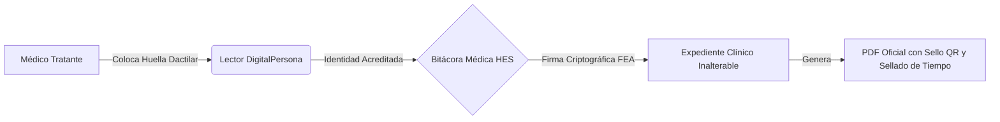

# Bitácora Médica HES — Seguridad, Biometría y Expediente Clínico Electrónico

## Documento Informativo y Ejecutivo para Órganos Directivos
**Hospital Escandón**  
*Dirección General • Dirección Médica • Comité de Expediente Clínico • Dirección Jurídica y TI*  
**Fecha:** Septiembre 2026  
**Marco Normativo:** NOM-004-SSA3-2012 (Expediente Clínico) • NOM-024-SSA3-2012 (Sistemas de Información de Registro Electrónico para la Salud) • Código de Comercio (Firma Electrónica Avanzada)

---

## 1. Resumen Ejecutivo

La **Bitácora Médica del Hospital Escandón** es la plataforma institucional diseñada para la gestión, captura, validación clínica y firma electrónica de los actos médicos que integran el **Expediente Clínico Electrónico (ECE)**.

### Objetivos Principales:
1. **Garantizar la Autenticidad y el No Repudio:** Certeza jurídica absoluta de que el médico tratante estuvo físicamente presente y autorizó el acto médico (mediante biometría dactilar).
2. **Blindaje Legal Institucional:** Integridad criptográfica inalterable; cualquier intento de modificar una nota médica ya firmada invalida automáticamente el documento.
3. **Eficiencia y Cero Papel:** Emisión instantánea de formatos oficiales vectoriales de alta calidad (Notas de Evolución, Consentimientos Informados, Recetas y Dietas) con sello digital y código QR de validación.



---

## 2. ¿Cómo Funciona la Bitácora en el Flujo Hospitalario?

La Bitácora digitaliza de forma integral los procesos clínicos en Urgencias, Hospitalización, Quirófano y Consulta Externa:

```
┌─────────────────────────┐     ┌─────────────────────────┐     ┌─────────────────────────┐
│   1. Registro Clínico   │ ──► │  2. Firma Biométrica    │ ──► │  3. Expediente Oficial  │
│ Captura de nota médica, │     │ El médico valida con su │     │ Generación de PDF con   │
│ fármacos, consentimientos│    │ huella en el lector USB │     │ sellos y código QR      │
└─────────────────────────┘     └─────────────────────────┘     └─────────────────────────┘
```

1. **Ingreso y Consulta:** Enfermería y médicos acceden a la información del paciente en tiempo real (procedimientos, diagnósticos CIE-10/CIE-11, cama asignada).
2. **Acto Médico:** El médico redacta la evolución del paciente, prescribe medicamentos en la orden médica o formaliza un consentimiento informado.
3. **Estampado de Firma:** Al terminar, el médico coloca su dedo en el lector biométrico. El sistema valida su identidad en menos de 1 segundo y estampa su **Firma Electrónica Avanzada (FEA)**.
4. **Resguardo y Validación:** El documento queda blindado en la base de datos y se genera el archivo PDF con membrete oficial del Hospital Escandón listo para impresión o consulta en peritaje.

---

## 3. Biometría Dactilar DigitalPersona: ¿Cómo opera y por qué es segura?

### A. No se almacenan imágenes de huellas (Privacidad y Protección de Datos)
Por estricto apego a la **Ley Federal de Protección de Datos Personales (LFPDPPP)** y las mejores prácticas internacionales:
* El sistema **NUNCA guarda fotos, imágenes ni escaneos de las huellas** de los médicos.
* Lo que se procesa es una **plantilla matemática abstracta (FMD bajo norma ANSI/NIST 378)** compuesta por coordenadas de minucias dactilares.
* A partir de esa plantilla matemática es **imposible reconstruir la imagen del dedo**, protegiendo la privacidad del personal de salud ante cualquier eventualidad.

### B. Principio de No Repudio Estricto (Sin bypass de contraseña)
* **¿Por qué la firma exige huella obligatoria?**  
  En muchos hospitales, los sistemas que permiten firmar con *usuario y contraseña* fracasan legalmente porque los médicos comparten sus claves con enfermeros o médicos internos por comodidad. En caso de una demanda médica, el médico puede argumentar: *"Yo no firmé eso, alguien usó mi contraseña"*.
* **La Solución en HES:**  
  La firma electrónica está **100% condicionada a la lectura biométrica física**. Esto garantiza ante COFEPRIS, jueces y aseguradoras que **el médico adscrito fue quien autorizó personalmente el procedimiento**.

### C. Auto-Refresco y Continuidad Operativa
Para evitar que problemas comunes (sensor con gel antibacterial, dedo colocado con poca presión) frenen la atención médica:
* El sistema cuenta con **auto-refresco inteligente**: si la lectura no es clara, el lector se reinicia automáticamente en **800 milisegundos**, permitiendo al médico volver a colocar el dedo de inmediato sin congelar pantallas, sin bloquear su usuario y sin requerir recargar la página (`F5`).

---

## 4. Firma Electrónica Avanzada (FEA) e Integridad Documental

La Bitácora Médica implementa los mismos estándares criptográficos utilizados por el **SAT y el Sistema Financiero Nacional**, adaptados al expediente clínico:

```
                  ┌──────────────────────────────────────────────┐
                  │          Contenido de la Nota Médica         │
                  │ (Paciente, Diagnóstico, Indicaciones, Fecha) │
                  └──────────────────────┬───────────────────────┘
                                         │
                                         ▼ Función Hash SHA-256
                  ┌──────────────────────────────────────────────┐
                  │       Huella Digital del Documento (Hash)    │
                  │   e3b0c44298fc1c149afbf4c8996fb92427ae41...  │
                  └──────────────────────┬───────────────────────┘
                                         │ + Clave Privada ECDSA (Médico)
                                         ▼
                  ┌──────────────────────────────────────────────┐
                  │        SELLO DIGITAL FEA INALTERABLE         │
                  │ ECDSA:MEQCID7x8k1m...9Zb2qK4x1Lw50pQvNx      │
                  └──────────────────────────────────────────────┘
```

### 1. Claves Criptográficas Asimétricas (ECDSA P-256)
* Cada médico registrado posee un par de llaves criptográficas únicas (Curva Elíptica P-256 / SHA-256).
* Su clave privada de firma se encuentra **cifrada en la base de datos**. Solo se desbloquea en memoria RAM durante los milisegundos en que el médico coloca su huella válida.

### 2. Detección Instantánea de Manipulación (Integridad)
* Cada documento genera un código resumen único (**Hash SHA-256**).
* **Si una persona intentara alterar el texto en la base de datos** (por ejemplo, cambiar la dosis de un fármaco o la hora de una cirugía), el Hash cambiará por completo y el Sello Digital quedará roto. La Bitácora alertará de inmediato: **`INTEGRIDAD_COMPROMETIDA`**, impidiendo falsificaciones o alteraciones extemporáneas.

### 3. Sellado de Tiempo y Fecha Local Exacta (NOM-004)
* Cada acto firmado registra la fecha y hora exacta del servidor hospitalario sincronizado, impidiendo el "antidatado" (firmar con fecha del día anterior) y aportando validez pericial ante auditorías.

---

## 5. Formatos Oficiales y Expediente Físico/Digital

La Bitácora genera documentos médicos en formato **PDF vectorial de alta definición (600 DPI)** con el membrete institucional oficial del Hospital Escandón:

| Código de Formato | Nombre del Documento | Área Hospitalaria |
| :--- | :--- | :--- |
| **HE-DIRMED-SINPRO-PLT-87/01** | Nota de Evolución Médica de Urgencias | Urgencias / Choque |
| **HE-DIRMED-SINPRO-PLT-04** | Consentimiento para Colocación de Catéter | Terapia / Hospitalización |
| **HE-DIRMED-SINPRO-PLT-12** | Consentimiento Gineco-Obstétrico Urgencias | Tococirugía / Urgencias |
| **HE-DIRMED-SINPRO-PLT-25** | Consentimiento Gineco-Obstetricia y Consulta Ext. | Consulta / Hospitalización |
| **HE-DIRMED-SINPRO-PLT-34/01** | Consentimiento para Prueba de Mesa Inclinada | Cardiología / Fisiología |
| **RECETA-PTDG** | Prescripción Farmacológica Hospitalaria | Farmacia / Piso |
| **DIETA-MR_SOL_DIET** | Régimen Dietético y Cuidados de Enfermería | Nutrición / Enfermería |

### Elementos de Seguridad Impresos en Cada Hoja:
1. **Cadena Original de Firma:** Contiene los identificadores del paciente, médico, cédula profesional y resumen clínico.
2. **Sello Digital FEA:** Código criptográfico único de autenticidad.
3. **Código QR Institucional:** Permite escanear el documento con un celular o tablet para verificar en el sistema si la hoja impresa coincide 1:1 con el expediente electrónico original.

---

## 6. Seguridad de la Infraestructura y Red Hospitalaria

Para proteger la información confidencial de los pacientes:
* **Operación en Red Local (Intranet):** El microservicio de matching biométrico y las bases de datos operan de forma aislada dentro de la infraestructura del hospital (`127.0.0.1` / Red HES), sin exponer puertos al internet público.
* **Protección Anti-Replay (Challenge de 120 segundos):** Cada intento de firma genera un token de un solo uso que expira en 2 minutos. Si alguien interceptara el tráfico de red, el token ya no podrá ser reutilizado para firmar otros documentos.
* **Trazabilidad y Auditoría Continua:** Todas las operaciones (creación de pacientes, firmas, prescripciones, cambios de estatus) quedan registradas en una bitácora de auditoría inmutable con fecha, hora, IP de la terminal y usuario responsable.

---

## 7. Beneficios para el Hospital Escandón

```
┌────────────────────────────────────────────────────────────────────────────┐
│                    BENEFICIOS CLAVE PARA LA INSTITUCIÓN                    │
├─────────────────────────┬──────────────────────────┬───────────────────────┤
│    BLINDAJE LEGAL       │    EFICIENCIA CLÍNICA    │    CONTROL Y COBRO    │
│                         │                          │                       │
│ • Cumplimiento total    │ • Eliminación de notas   │ • Conciliación de     │
│   NOM-004 y NOM-024.    │   ilegibles a mano.      │   honorarios médicos  │
│ • Cero riesgo de firmas │ • Consulta inmediata del │   solo sobre notas    │
│   falsificadas.         │   historial en cualquier │   debidamente         │
│ • Documentos listos     │   piso del hospital.     │   firmadas con FEA.   │
│   para peritajes de     │ • Ahorro del 100% en     │ • Cero pérdidas de    │
│   aseguradoras o juzgado│   papelería extraviada.  │   formatos físicos.   │
└─────────────────────────┴──────────────────────────┴───────────────────────┘
```

---

## 8. Conclusión

La arquitectura de la **Bitácora Médica HES** sitúa al Hospital Escandón a la vanguardia tecnológica y jurídica hospitalaria. Al combinar **biometría dactilar física, criptografía de curva elíptica P-256 y formatos normativos oficiales**, el hospital garantiza la máxima seguridad para sus pacientes, certeza legal para su cuerpo médico y solidez institucional ante cualquier autoridad sanitaria.
