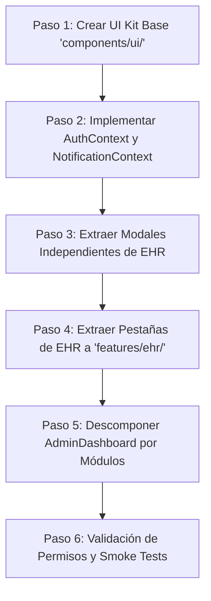

# 🎨 PLAN MAESTRO DE REFACTORIZACIÓN FRONTEND: ARQUITECTURA POR FEATURES
## Plataforma Bitácora Médica HE - React 18 + Vite + Tailwind CSS

---

### 📋 1. Diagnóstico de Deuda Técnica Visual

#### Estado Actual
* **Componentes Monolíticos ("God Components"):**
  * `PatientDashboard.jsx`: **4,377 líneas** (7 pantallas clínicas y 8 modales completos en un solo archivo).
  * `AdminDashboard.jsx`: **1,769 líneas** (5 módulos administrativos distintos acoplados en pestañas).
  * `CamasDashboard.jsx`: **818 líneas** y `CapturaEnfermeria.jsx`: **734 líneas**.
* **Manejo de Estado Descentralizado:**
  * No existe un `AuthContext` ni Store global; el estado de sesión y rol se consulta leyendo directamente de `localStorage` en más de 20 archivos distintos sin reactividad.
* **Llamadas a API Acopladas:**
  * No hay Custom Hooks de dominio (`useEhr`, `useCamas`, `usePacientes`). Las llamadas `api.get()` / `api.post()` están escritas inline en `useEffect` y eventos `onClick`.
* **Falta de Sistema de Diseño Atómico:**
  * No existen componentes reutilizables como `<Button>`, `<Modal>`, `<Badge>`, `<Card>` o `<Input>`. Cada modal y botón vuelve a escribir de 15 a 25 clases Tailwind idénticas desde cero.

---

### 📂 2. Nueva Estructura Modular Basada en *Features*

```text
frontend/src/
├── assets/                     # Logos y recursos gráficos institucionales
│
├── components/                 # Componentes genéricos y Sistema de Diseño (UI Kit)
│   ├── ui/
│   │   ├── Button.jsx          # Botón estándar con variantes (primary, danger, ghost, loading)
│   │   ├── Modal.jsx           # Modal base accesible con backdrop, animación y tecla ESC
│   │   ├── Input.jsx           # Input estilizado con label, icono y mensaje de error
│   │   ├── Select.jsx          # Selector accesible estilizado
│   │   ├── Badge.jsx           # Etiquetas de estado (Activo, Suspendido, Ocupado, Alta)
│   │   ├── Card.jsx            # Contenedor estándar con sombra y bordes
│   │   ├── Table.jsx           # Tabla paginada y responsiva reutilizable
│   │   └── Toast.jsx           # Notificaciones flotantes globales de error/éxito
│   │
│   ├── Layout.jsx              # Navbar, Sidebar y Breadcrumbs reactivos a roles
│   └── ProtectedRoute.jsx      # Guardián de rutas autenticadas
│
├── context/                    # Estado Global Reactivo
│   ├── AuthContext.jsx         # Usuario activo, rol, token, permisos granulares y logout
│   └── NotificationContext.jsx # Cola de alertas y avisos de error (ej: HTTP 503)
│
├── features/                   # Módulos Funcionales de Dominio (Vertical Slices)
│   ├── auth/                   # Autenticación y Biometría
│   │   ├── components/LoginDualForm.jsx
│   │   ├── components/BiometricReaderStatus.jsx
│   │   └── hooks/useAuthLogin.js
│   │
│   ├── ehr/                    # Expediente Clínico (Descomposición de PatientDashboard)
│   │   ├── components/
│   │   │   ├── PatientHeader.jsx         # Ficha del paciente y alertas críticas
│   │   │   ├── TimelineTab.jsx           # Línea de tiempo de eventos clínicos
│   │   │   ├── EvolutionSoapTab.jsx      # Notas de evolución (Formato 87/01)
│   │   │   ├── PrescriptionsTab.jsx      # Fármacos activos y suspendidos
│   │   │   ├── DietsTab.jsx              # Régimen nutricional y cuidados
│   │   │   ├── AllergiesTab.jsx          # Alergias activas y catálogo DIS_AL
│   │   │   └── FormatsCatalogTab.jsx     # Catálogo de formatos institucionales
│   │   ├── modals/
│   │   │   ├── VitalsModal.jsx           # Captura de PTVS
│   │   │   ├── PrescriptionModal.jsx     # Prescripción con huella dactilar
│   │   │   ├── DiscontinueMedModal.jsx   # Suspensión de fármaco con motivo
│   │   │   ├── DietModal.jsx             # Solicitud de régimen dietético
│   │   │   ├── AllergyModal.jsx          # Búsqueda DIS_AL y registro
│   │   │   ├── NotaUrgenciasModal.jsx    # Captura SOAP 87/01
│   │   │   ├── Consentimiento3201Modal.jsx
│   │   │   ├── ConsentimientoEEDModal.jsx
│   │   │   └── BiometricSigningModal.jsx # Firma de notas con huella digital
│   │   └── hooks/
│   │       ├── usePatientEhr.js          # Fetch y sincronización de expediente
│   │       └── useBiometricSigning.js    # Orquestación de firma NOM-024
│   │
│   ├── camas/                  # Censo Hospitalario y Ocupación
│   │   ├── components/BedGrid.jsx
│   │   ├── components/BedCard.jsx
│   │   ├── modals/TransferModal.jsx
│   │   └── hooks/useCamas.js
│   │
│   ├── admin/                  # Panel Administrativo (Descomposición de AdminDashboard)
│   │   ├── components/
│   │   │   ├── StatsOverview.jsx         # Gráficas analíticas Recharts
│   │   │   ├── MedicosManager.jsx        # Padrón médico y enrolamiento biométrico
│   │   │   ├── UsersManager.jsx          # Usuarios, roles y permisos granulares
│   │   │   ├── CatalogosManager.jsx      # Áreas, tipos y formatos
│   │   │   └── AuditLogsViewer.jsx       # Trazabilidad y logs de auditoría
│   │   └── hooks/useAdminData.js
│   │
│   ├── captura/                # Captura Rápida de Enfermería
│   │   ├── components/CapturaForm.jsx
│   │   └── hooks/useCaptura.js
│   │
│   └── agenda/                 # Agenda Médica y Citas
│       ├── components/AgendaCalendar.jsx
│       └── hooks/useAgenda.js
│
├── hooks/                      # Hooks transversales de infraestructura
│   ├── useDigitalPersona.js    # Conexión con lector de huellas WBF
│   ├── useAutoLogout.js        # Cierre automático por inactividad
│   └── useEscapeKey.js         # Cierre de modales con tecla ESC
│
├── api.js                      # Instancia de Axios con interceptores JWT y errores
├── App.jsx                     # Enrutador limpio y Providers globales
└── main.jsx                    # Entrypoint de Vite
```

---

### 🛡️ 3. Gestión de Sesión Global: `AuthContext`

#### Problema Actual
Actualmente, cada componente invoca:
```jsx
// ❌ CÓDIGO ACTUAL: Lecturas directas de localStorage no reactivas
const rol = localStorage.getItem('rol');
const token = localStorage.getItem('token');
const usuario = localStorage.getItem('usuario');
```

#### Solución Propuesta (`src/context/AuthContext.jsx`)
Centraliza el estado del usuario en un contexto de React con reactividad inmediata:

```jsx
// ✅ ARQUITECTURA PROPUESTA: AuthContext reactivo
import React, { createContext, useContext, useState, useEffect } from 'react';
import { api } from '../api';

const AuthContext = createContext(null);

export function AuthProvider({ children }) {
  const [user, setUser] = useState(null);
  const [token, setToken] = useState(localStorage.getItem('token'));
  const [loading, setLoading] = useState(true);

  useEffect(() => {
    if (token) {
      // Decodificar usuario y rol desde JWT / localStorage
      setUser({
        username: localStorage.getItem('usuario') || '',
        rol: localStorage.getItem('rol') || '',
        medicoId: localStorage.getItem('medico_id') || null,
        permisos: JSON.parse(localStorage.getItem('permisos') || '{}')
      });
    } else {
      setUser(null);
    }
    setLoading(false);
  }, [token]);

  const login = (authToken, userData) => {
    localStorage.setItem('token', authToken);
    localStorage.setItem('rol', userData.rol);
    localStorage.setItem('usuario', userData.username);
    if (userData.medico_id) localStorage.setItem('medico_id', userData.medico_id);
    setToken(authToken);
    setUser(userData);
  };

  const logout = () => {
    localStorage.removeItem('token');
    localStorage.removeItem('rol');
    localStorage.removeItem('usuario');
    localStorage.removeItem('medico_id');
    setToken(null);
    setUser(null);
    window.location.href = '/login';
  };

  const hasRole = (...allowedRoles) => {
    return user && allowedRoles.includes(user.rol);
  };

  return (
    <AuthContext.Provider value={{ user, token, isAuthenticated: !!token, loading, login, logout, hasRole }}>
      {children}
    </AuthContext.Provider>
  );
}

export const useAuth = () => useContext(AuthContext);
```

---

### 🧩 4. Estrategia de Descomposición de Monolitos

#### Caso 1: Descomposición de `PatientDashboard.jsx` (4,377 líneas -> ~150 líneas)
El archivo principal se convierte en un simple orquestador de pestañas y modales:

```jsx
// ✅ PatientDashboard.jsx refactorizado
export default function PatientDashboard() {
  const { pt_num } = useParams();
  const { data, loading, error, refreshEhr } = usePatientEhr(pt_num);
  const [activeTab, setActiveTab] = useState('timeline');

  if (loading) return <PatientSkeletonLoader />;
  if (error) return <PatientErrorBanner message={error} onRetry={refreshEhr} />;

  return (
    <div className="flex flex-col h-full bg-slate-50">
      <PatientHeader patient={data.patient} vitals={data.ptvs} />
      <EhrTabsNav activeTab={activeTab} onChangeTab={setActiveTab} />
      
      <main className="flex-1 overflow-y-auto p-6">
        {activeTab === 'timeline' && <TimelineTab timeline={data.timeline} />}
        {activeTab === 'soap' && <EvolutionSoapTab patientId={pt_num} notas={data.notas} onUpdate={refreshEhr} />}
        {activeTab === 'meds' && <PrescriptionsTab patientId={pt_num} meds={data.meds} onUpdate={refreshEhr} />}
        {activeTab === 'diets' && <DietsTab patientId={pt_num} diet={data.diet} onUpdate={refreshEhr} />}
        {activeTab === 'allergies' && <AllergiesTab patientId={pt_num} allergies={data.allergies} onUpdate={refreshEhr} />}
      </main>
    </div>
  );
}
```

---

### 🚦 5. Hoja de Ruta de Extracción Segura (Paso a Paso)

Para no romper el sistema ni interrumpir la operación clínica:



1. **Paso 1 (Cero Riesgo): Construir el UI Kit (`src/components/ui/`)**
   * Crear `<Button>`, `<Modal>`, `<Input>`, `<Badge>`, `<Card>`.
   * Probarlos aisladamente sin modificar las páginas actuales.
2. **Paso 2 (Bajo Riesgo): Implementar `AuthContext` en `App.jsx`**
   * Envolver `<App />` con `<AuthProvider>`.
   * Migrar `ProtectedRoute.jsx` y `Layout.jsx` para usar `useAuth()`.
3. **Paso 3 (Medio Riesgo): Extraer los 8 Modales de `PatientDashboard.jsx`**
   * Mover `VitalsModal`, `PrescriptionModal`, `NotaUrgenciasModal`, etc., a `src/features/ehr/modales/`.
   * Cada modal recibe únicamente sus `props` (`isOpen`, `onClose`, `patientId`, `onSuccess`).
4. **Paso 4 (Medio Riesgo): Extraer las Pestañas de `PatientDashboard.jsx`**
   * Mover el contenido de cada pestaña a `TimelineTab.jsx`, `EvolutionSoapTab.jsx`, `PrescriptionsTab.jsx`.
   * `PatientDashboard.jsx` queda reducido a menos de **150 líneas**.
5. **Paso 5 (Medio Riesgo): Descomponer `AdminDashboard.jsx`**
   * Separar en `MedicosManager.jsx`, `UsersManager.jsx`, `CatalogosManager.jsx` y `StatsOverview.jsx`.
6. **Paso 6 (Verificación): Smoke Test de Flujos Críticos**
   * Validar inicio de sesión por credenciales y huella.
   * Validar captura de signos vitales, recetas y firma de notas SOAP.
