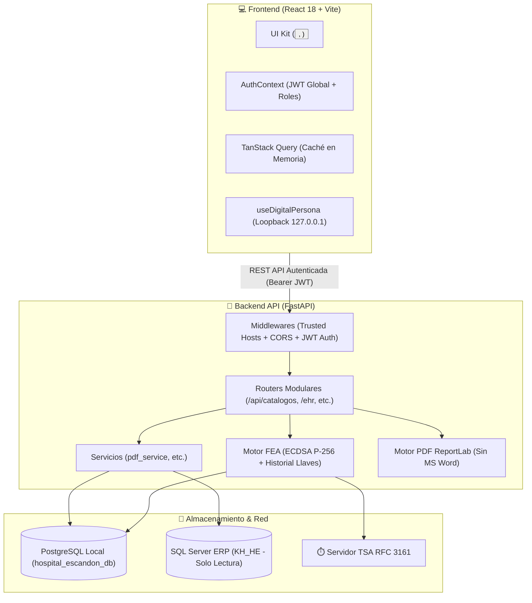

# 🏥 Bitácora Médica HES (MediReg HES)

Sistema integral de gestión clínica, control de atenciones médicas, expediente electrónico (EHR), auditoría biométrica, firma electrónica avanzada (FEA) y generación de formatos clínicos oficiales para el **Hospital Escandón**.

---

## 📌 Resumen Ejecutivo

**Bitácora Médica HES** es una plataforma hospitalaria modular diseñada para optimizar los flujos de trabajo médicos, administrativos y de enfermería, asegurando la integridad, confidencialidad, no repudio y estricto cumplimiento normativo (**NOM-004-SSA3-2012** y **NOM-024-SSA3-2012**) en cada registro clínico.

### ✨ Capacidades Principales:
- 🩺 **Expediente Clínico Electrónico (EHR):** Dashboard de paciente con datos demográficos, signos vitales, alergias catalogadas (`DIS_AL`), dietas, medicamentos activos y línea de tiempo interactiva de notas médicas.
- 📄 **Motor Oficial de Formatos Clínicos PDF (ReportLab Platypus):** Generador de notas médicas y comprobantes en Python puro (100% multiplataforma, sin dependencias de Microsoft Word ni Windows COM), calibrado según especificaciones institucionales RDLC a 600 DPI.
- 🔒 **Firma Electrónica Avanzada (FEA NOM-024):** Criptografía asimétrica **ECDSA P-256 (SECP256R1)** con derivación KEK vía **HKDF-SHA256**, sellado de tiempo RFC 3161 (TSA) y **tabla de historial de llaves públicas** para garantizar el no repudio retroactivo ante rotaciones de credenciales biométricas.
- 🖐️ **Integración Biométrica (DigitalPersona U.are.U SDK):** Captura segura de plantillas FMD en clientes Windows de intranet, con estados de hardware aislados contra condiciones de carrera.
- ⚡ **Frontend de Alto Rendimiento:** React 18 + Vite con **TanStack Query (React Query)** para caché en memoria (*stale-while-revalidate*), **AuthContext global**, UI Kit atómico (`<Button />`, `<AlertBanner />`) y arquitectura modular por *Features*.
- 💾 **Custodia y Respaldos Automatizados:** Scripts de volcado (`pg_dump`) para Windows (`.bat`) y Linux (`.sh`) con rotación automática de 14 días para la base de datos PostgreSQL.

---

## 🏗️ Arquitectura del Sistema



---

## 📂 Estructura del Código

```text
Bitacora_HES/
├── backend/                                # API REST en FastAPI (Python 3.10+)
│   ├── main.py                             # Orquestador, middlewares y endpoints
│   ├── security.py                         # Seguridad JWT, bcrypt y decoradores require_role
│   ├── crypto_fea.py                       # Criptografía asimétrica FEA con historial de llaves
│   ├── test_crypto_fea.py                  # Suite de pruebas criptográficas FEA
│   ├── models.py / schemas.py              # Modelos SQLAlchemy y esquemas Pydantic
│   ├── kh_database.py                      # Conector de solo lectura a SQL Server (KH_HE)
│   ├── pdf_engine_v2.py                    # Motor PDF ReportLab V2 (Formato 87/01, etc.)
│   ├── pdf_generator.py                    # Comprobantes de atención con código QR
│   ├── routers/
│   │   ├── __init__.py
│   │   └── catalogos.py                    # Router modular de catálogos clínicos
│   ├── services/
│   │   ├── __init__.py
│   │   └── pdf_service.py                  # Servicio unificado de generación de PDFs
│   ├── requirements.txt                    # Dependencias Python (Multiplataforma)
│   └── .env.example                        # Plantilla de variables de entorno
├── frontend/                               # Aplicación Web SPA (React 18 + Vite)
│   ├── src/
│   │   ├── main.jsx                        # Entrypoint con QueryClientProvider y AuthProvider
│   │   ├── context/
│   │   │   └── AuthContext.jsx             # Estado global de sesión y control de roles
│   │   ├── components/
│   │   │   └── ui/
│   │   │       ├── Button.jsx              # Botón atómico del UI Kit con isLoading
│   │   │       └── AlertBanner.jsx         # Banners de alerta para estado de API
│   │   ├── features/
│   │   │   ├── admin/
│   │   │   │   ├── AuditLogsTab.jsx        # Pestaña de trazabilidad y auditoría
│   │   │   │   └── UsersManagerTab.jsx     # Pestaña de gestión de usuarios y roles
│   │   │   ├── biometrics/
│   │   │   │   └── BiometricSignModal.jsx  # Modal centralizado de firma biométrica
│   │   │   └── ehr/
│   │   │       └── modals/
│   │   │           └── AllergiesModal.jsx  # Modal modular de catálogo de alergias
│   │   ├── hooks/
│   │   │   ├── useQueries.js               # Queries de TanStack React Query
│   │   │   ├── useApiError.js              # Manejo centralizado de errores HTTP
│   │   │   └── useDigitalPersona.js        # Integración con hardware biométrico
│   │   └── pages/                          # Vistas (PatientDashboard, CapturaEnfermeria, etc.)
│   ├── package.json
│   └── vite.config.js
├── scripts/
│   ├── backup_db.bat                       # Script de respaldo PostgreSQL para Windows
│   └── backup_db.sh                        # Script de respaldo PostgreSQL para Linux / Docker
├── docs/                                   # Bóveda de documentación (Obsidian)
├── README.md                               # Documentación principal
└── PLAN_REFACTORIZACION_FRONTEND.md        # Plan maestro de arquitectura frontend
```

---

## 🔐 Manual de Seguridad y Políticas Críticas para IAs y Desarrolladores

Cualquier IA o desarrollador que realice modificaciones en este proyecto **DEBE RESPETAR ESTRICTAMENTE** las siguientes reglas:

### 1. El archivo `.env` es Sagrado
* **NUNCA** subas `.env` al repositorio. Está estrictamente ignorado en `.gitignore`.
* Si agregas una nueva variable de configuración, documéntala en `backend/.env.example`.

### 2. No Repudio Criptográfico (NOM-024 / NOM-004)
* Las llaves públicas históricas de los médicos residen en la tabla `historial_llaves_fea`.
* **NUNCA** sobrescribas ni borres registros de llaves públicas cuando un médico re-enrole su huella o cambie de credenciales. Al rotar, marca la anterior como `activo = False` y registra la nueva. De lo contrario, se anula la validez legal de las firmas anteriores.

### 3. Independencia de Plataforma en Generación de PDFs
* **PROHIBIDO** utilizar librerías que invoquen Microsoft Word (`docx2pdf`, `pywin32`, `pythoncom`).
* Todos los documentos clínicos deben generarse en Python puro mediante **ReportLab Platypus** o **xhtml2pdf**, permitiendo la ejecución tanto en Windows como en contenedores Linux / Docker.

### 4. Caché y Rendimiento Frontend (TanStack Query)
* Para nuevas pantallas o entidades de datos, utiliza o extiende los hooks en `frontend/src/hooks/useQueries.js`.
* Evita poblar componentes con `useEffect + api.get` redundantes.

### 5. Higiene de Hardware Biométrico
* **NUNCA** imprimas objetos de huellas (`event.samples`, tokens FMD o cadenas binarias) en `console.log`.
* Garantiza que solo un modal o hook biométrico esté escuchando eventos de captura a la vez para evitar condiciones de carrera.

---

## 🚀 Puesta en Marcha

### 1. Configuración del Backend
```powershell
cd backend
python -m venv venv
.\venv\Scripts\activate
pip install -r requirements.txt
cp .env.example .env
# Configurar credenciales en .env
python -m uvicorn main:app --reload --port 8000
```

### 2. Configuración del Frontend
```powershell
cd frontend
npm install
npm run dev
```

### 3. Ejecución de Pruebas Automatizadas
```powershell
# Pruebas Criptográficas FEA
python backend/test_crypto_fea.py

# Compilación de Producción Frontend
cd frontend && npm run build
```

---

## 📄 Licencia y Confidencialidad

Propiedad exclusiva del **Hospital Escandón** / **Ing. Alberto García Mendoza**.  
Todos los derechos reservados. El uso, copia o distribución no autorizada de este código o sus especificaciones clínicas está estrictamente prohibido.
