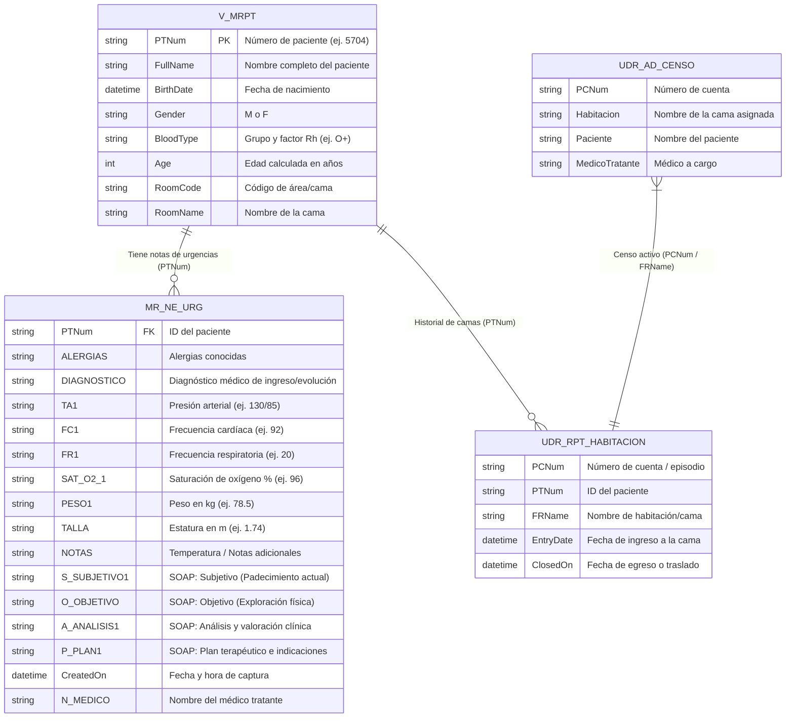

# 🧪 Guía de Pruebas e Inyección de Datos en SQL Server ("La Vertical" - KH_HE)

Esta guía explica paso a paso cómo se estructura, manipula e inyectan datos de prueba en la base de datos central de SQL Server (**`KH_HE`**, referida en el sistema como *"la Vertical"*), para validar el **Expediente Clínico Electrónico (EHR Dashboard)** y el **Motor Oficial de Formatos PDF**.

---

## 🏥 1. Contexto: ¿Qué es la "Vertical" (`KH_HE`)?

La base de datos **`KH_HE`** (Microsoft SQL Server) es el sistema hospitalario central del **Hospital Escandón**. En ella se almacenan los expedientes reales, el censo de camas, ingresos, notas de evolución y signos vitales.

En el backend de **Bitácora Médica HES**:
* La aplicación se conecta mediante **`pyodbc`** (utilizando `backend/kh_database.py`).
* En producción opera en modo **solo lectura** para garantizar máxima seguridad y aislamiento.
* En **entornos de desarrollo / pruebas / QA**, requerimos inyectar registros clínicos controlados (pacientes mock con diagnósticos, signos vitales y notas SOAP) para verificar que el frontend y el generador de PDF procesen y rendericen la información con total fidelidad.

---

## 🗄️ 2. Mapeo de Tablas y Esquemas en SQL Server

A continuación se detallan las tablas y vistas principales de `KH_HE` involucradas en el flujo clínico:



---

## 💉 3. Métodos de Inyección de Datos

Existen dos métodos para inyectar o actualizar datos de prueba:

### Método A: Inyección Automatizada con Script en Python (Recomendado)

Disponemos de un script utilitario en `backend/scripts/inject_test_patient_sql.py` que lee automáticamente las credenciales de `backend/.env` y realiza la inserción o actualización mediante ODBC.

#### Ejecución rápida:
```powershell
# Desde la raíz del proyecto:
cd backend
python scripts/inject_test_patient_sql.py
```

#### Código del inyector (`backend/scripts/inject_test_patient_sql.py`):
```python
import os
import pyodbc
from dotenv import load_dotenv

env_path = os.path.join(os.path.dirname(os.path.dirname(os.path.abspath(__file__))), '.env')
load_dotenv(env_path)

def inject_test_patient(pt_num="5704"):
    server = os.getenv('KH_SERVER')
    database = os.getenv('KH_DATABASE', 'KH_HE')
    username = os.getenv('KH_USERNAME')
    password = os.getenv('KH_PASSWORD')
    
    conn_str = f"DRIVER={{SQL Server}};SERVER={server};DATABASE={database};UID={username};PWD={password};Network=DBMSSOCN;TrustServerCertificate=yes;"
    conn = pyodbc.connect(conn_str)
    cursor = conn.cursor()

    # Actualizar o Insertar Nota Clínica en MR_NE_URG
    cursor.execute("""
        IF EXISTS (SELECT 1 FROM MR_NE_URG WHERE PTNum = ?)
            UPDATE MR_NE_URG
            SET ALERGIAS = 'PENICILINA, SULFAS',
                DIAGNOSTICO = 'DOLOR ABDOMINAL AGUDO EN FOSA ILIACA DERECHA. SOSPECHA DE APENDICITIS AGUDA.',
                TA1 = '130/85', FC1 = '92', FR1 = '20', SAT_O2_1 = '96', PESO1 = '78.5', TALLA = '1.74', NOTAS = '38.2',
                S_SUBJETIVO1 = 'Paciente masculino de 35 anos que acude por dolor abdominal de 12 hrs de evolucion en fosa iliaca derecha con vomito.',
                O_OBJETIVO = 'EXPLORACION FISICA:\nConsciente, doloroso en FID. McBurney (+), Rovsing (+), Rebote (+). TA 130/85, FC 92, FR 20, Temp 38.2 C.',
                A_ANALISIS1 = 'ANALISIS / VALORACION:\nCuadro clinico compatible con Apendicitis Aguda. Escala de Alvarado: 8 puntos.',
                P_PLAN1 = 'PLAN TERAPEUTICO:\n1. Ayuno.\n2. Solucion Hartmann 1000ml.\n3. Ketorolaco 30mg IV.\n4. Laboratorios y USG Abdominal.',
                CreatedOn = GETDATE(),
                N_MEDICO = 'DR. ALEJANDRO MENDOZA RIVERA'
            WHERE PTNum = ?
        ELSE
            INSERT INTO MR_NE_URG (
                PTNum, ALERGIAS, DIAGNOSTICO, TA1, FC1, FR1, SAT_O2_1, PESO1, TALLA, NOTAS,
                S_SUBJETIVO1, O_OBJETIVO, A_ANALISIS1, P_PLAN1, CreatedOn, N_MEDICO
            ) VALUES (
                ?, 'PENICILINA, SULFAS', 'DOLOR ABDOMINAL AGUDO EN FOSA ILIACA DERECHA. SOSPECHA DE APENDICITIS AGUDA.',
                '130/85', '92', '20', '96', '78.5', '1.74', '38.2',
                'Paciente masculino de 35 anos que acude por dolor abdominal de 12 hrs de evolucion en fosa iliaca derecha con vomito.',
                'EXPLORACION FISICA:\nConsciente, doloroso en FID. McBurney (+), Rovsing (+), Rebote (+). TA 130/85, FC 92, FR 20, Temp 38.2 C.',
                'ANALISIS / VALORACION:\nCuadro clinico compatible con Apendicitis Aguda. Escala de Alvarado: 8 puntos.',
                'PLAN TERAPEUTICO:\n1. Ayuno.\n2. Solucion Hartmann 1000ml.\n3. Ketorolaco 30mg IV.\n4. Laboratorios y USG Abdominal.',
                GETDATE(), 'DR. ALEJANDRO MENDOZA RIVERA'
            )
    """, (pt_num, pt_num, pt_num))

    conn.commit()
    conn.close()
    print(f"[OK] Inyección de datos lista para paciente {pt_num}")

if __name__ == '__main__':
    inject_test_patient("5704")
```

---

### Método B: Sentencias T-SQL Directas (SSMS / DBeaver / Azure Data Studio)

Si prefieres ejecutar directamente en un gestor SQL conectado a la base de datos `KH_HE`:

```sql
-- 1. Seleccionar la base de datos de la vertical
USE KH_HE;
GO

-- 2. Declarar ID del paciente de prueba
DECLARE @PTNum VARCHAR(20) = '5704';

-- 3. Inyectar o Actualizar la Nota de Evolución de Urgencias
IF EXISTS (SELECT 1 FROM MR_NE_URG WHERE PTNum = @PTNum)
BEGIN
    UPDATE MR_NE_URG
    SET 
        ALERGIAS = 'PENICILINA, SULFAS',
        DIAGNOSTICO = 'DOLOR ABDOMINAL AGUDO EN FOSA ILIACA DERECHA. SOSPECHA DE APENDICITIS AGUDA.',
        TA1 = '130/85',
        FC1 = '92',
        FR1 = '20',
        SAT_O2_1 = '96',
        PESO1 = '78.5',
        TALLA = '1.74',
        NOTAS = '38.2', -- Temperatura en grados Celsius
        S_SUBJETIVO1 = 'Paciente masculino de 35 anos que acude al servicio de urgencias por presentar dolor abdominal tipo colico de 12 horas de evolucion, localizado inicialmente en epigastrio y que posteriormente migro a fosa iliaca derecha. Refiere ademas un episodio de vomito y sensacion de distension abdominal.',
        O_OBJETIVO = 'EXPLORACION FISICA:' + CHAR(13) + CHAR(10) +
                     '• Consciente, orientado, algico, en posicion antialgica.' + CHAR(13) + CHAR(10) +
                     '• Signos vitales: TA 130/85 mmHg, FC 92 lpm, FR 20 rpm, Temp 38.2 C, SatO2 96%.' + CHAR(13) + CHAR(10) +
                     '• Abdomen doloroso a la palpacion profunda en fosa iliaca derecha. McBurney positivo. Rovsing positivo. Rebote positivo.',
        A_ANALISIS1 = 'ANALISIS / VALORACION:' + CHAR(13) + CHAR(10) +
                      'Se trata de paciente masculino con cuadro clinico altamente sugestivo de apendicitis aguda. Escala de Alvarado: 8 puntos.',
        P_PLAN1 = 'PLAN TERAPEUTICO:' + CHAR(13) + CHAR(10) +
                  '1. Ayuno estricto.' + CHAR(13) + CHAR(10) +
                  '2. Solucion Hartmann 1000ml IV para 8 hrs.' + CHAR(13) + CHAR(10) +
                  '3. Ketorolaco 30mg IV c/8hrs.' + CHAR(13) + CHAR(10) +
                  '4. Ondansetron 4mg IV c/8hrs PRN.' + CHAR(13) + CHAR(10) +
                  '5. Laboratorios urgentes (BH, QS, EGO) y USG abdominal.',
        CreatedOn = GETDATE(),
        N_MEDICO = 'DR. ALEJANDRO MENDOZA RIVERA'
    WHERE PTNum = @PTNum;
END
ELSE
BEGIN
    INSERT INTO MR_NE_URG (
        PTNum, ALERGIAS, DIAGNOSTICO, TA1, FC1, FR1, SAT_O2_1, PESO1, TALLA, NOTAS,
        S_SUBJETIVO1, O_OBJETIVO, A_ANALISIS1, P_PLAN1, CreatedOn, N_MEDICO
    ) VALUES (
        @PTNum,
        'PENICILINA, SULFAS',
        'DOLOR ABDOMINAL AGUDO EN FOSA ILIACA DERECHA. SOSPECHA DE APENDICITIS AGUDA.',
        '130/85', '92', '20', '96', '78.5', '1.74', '38.2',
        'Paciente masculino de 35 anos que acude por dolor abdominal en FID con vomito.',
        'EXPLORACION FISICA: Abdomen blando, doloroso en FID, McBurney positivo.',
        'ANALISIS: Cuadro clinico sugestivo de apendicitis aguda.',
        'PLAN: Ayuno, analgesia, soluciones y valoracion quirurgica.',
        GETDATE(),
        'DR. ALEJANDRO MENDOZA RIVERA'
    );
END
GO

-- 4. Registrar Asignación de Habitación / Cama en Línea de Tiempo
IF NOT EXISTS (SELECT 1 FROM UDR_RPT_HABITACION WHERE PTNum = '5704' AND FRName = 'URGENCIAS C-01')
BEGIN
    INSERT INTO UDR_RPT_HABITACION (PCNum, PTNum, FRName, EntryDate, ClosedOn)
    VALUES ('PC-5704', '5704', 'URGENCIAS C-01', GETDATE(), NULL);
END
GO
```

---

## 🔄 4. Flujo de Validación Extremo a Extremo (E2E)

Una vez inyectados los datos en SQL Server, valida el flujo completo:

```text
┌─────────────────────────┐
│ 1. SQL Server (KH_HE)   │  Tabla MR_NE_URG & V_MRPT actualizadas
└───────────┬─────────────┘
            │  pyodbc query
            ▼
┌─────────────────────────┐
│ 2. Backend (FastAPI)    │  kh_database.fetch_full_ehr_dashboard("5704")
│    GET /api/ehr/paciente│  Retorna JSON unificado (Demográficos, Signos, SOAP, Timeline)
└───────────┬─────────────┘
            │  Axios HTTP
            ▼
┌─────────────────────────┐
│ 3. Frontend React       │  PatientDashboard.jsx renderiza Signos, Alergias en rojo,
│    http://localhost:5173│  Timeline de notas y botón "Imprimir PDF"
└───────────┬─────────────┘
            │  Click en Imprimir PDF
            ▼
┌─────────────────────────┐
│ 4. ReportLab V2 Engine  │  Genera nota institucional 600 DPI con datos inyectados
│    PDF Oficial RDLC     │  (HE-DIRMED-SINPRO-PLT-87/01)
└─────────────────────────┘
```

### URLs de Prueba Inmediata:
* **JSON del Expediente:** `http://localhost:8000/api/ehr/paciente/5704`
* **Descarga del PDF Oficial Dinámico:** `http://localhost:8000/api/ehr/paciente/5704/pdf-nota-urgencias`
* **Vista en Frontend:** `http://localhost:5173/ehr/paciente/5704`

---

## 🧹 5. Limpieza y Rollback de Datos de Prueba

Para eliminar registros temporales creados exclusivamente para pruebas:

```sql
USE KH_HE;
GO

-- Borrar únicamente registros de prueba creados para el paciente demo 5704
DELETE FROM MR_NE_URG WHERE PTNum = '5704';
DELETE FROM UDR_RPT_HABITACION WHERE PTNum = '5704' AND PCNum = 'PC-5704';
GO
```

---

## 💡 6. Buenas Prácticas y Consejos

1. **Rango de Pacientes de Prueba:** Utiliza siempre identificadores designados (ej. `5704` o la serie `9990`-`9999`) para evitar colisiones con pacientes hospitalizados reales.
2. **Formato de Signos Vitales:**
   * La presión arterial (`TA1`) debe registrarse como `Sistólica/Diastólica` (ej. `120/80` o `130/85`).
   * La temperatura en `NOTAS` se interpreta numéricamente (ej. `36.5` o `38.2`).
3. **Parámetro de Red `Network=DBMSSOCN`:** Al conectar con SQL Server mediante ODBC en Windows, siempre incluye `Network=DBMSSOCN` en la cadena de conexión para forzar comunicación TCP/IP directa y evitar retrasos en Named Pipes.
