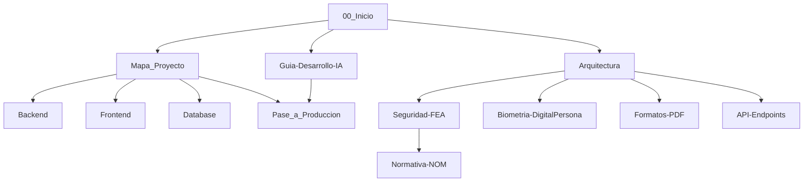

# 00_Inicio — Bóveda HES 🏥

> **Esta nota es el punto de entrada único de la plataforma Bitácora Médica HES.**
> Humanos e IAs deben empezar aquí. Fuente de verdad: `docs/` (vault Obsidian).

## Cómo usar esta bóveda (Obsidian)
1. En Obsidian: **Open folder as vault → `docs/`**.
2. Activa: Backlinks, Outgoing Links, Graph View, Tags, Templates (`plantillas/`).
3. Navega con el grafo o con `Ctrl/Cmd+O` (Quick Switcher). Todo está en Markdown con wikilinks de doble corchete.
4. Adjuntos van en `adjuntos/`. Notas diarias en `diario/`. Decisiones en `decisiones/ADR-*.md`.

## Mapa de conocimiento

### 1. Sistema
- [[Mapa_Proyecto]] — grafo navegable de módulos.
- [[Arquitectura]] — stack, diagrama end-to-end, estructura de carpetas.
- [[Glosario]] — lenguaje ubicuo (FEA, FMD, TSA, RDLC, KH_HE…).

### 2. Módulos
- [[Backend]] — FastAPI, `main.py`, `security.py`, `crypto_fea.py`, `routers/`, `services/`.
- [[Frontend]] — React+Vite, `AuthContext`, `useQueries`, features por dominio.
- [[Database]] — PostgreSQL, `models.py`, `historial_llaves_fea`, respaldos.
- [[API-Endpoints]] — contrato REST, auth JWT, roles.

### 3. Transversales críticos
- [[Seguridad-FEA]] — ECDSA P-256 + HKDF + Fernet + TSA RFC 3161, no repudio.
- [[Biometria-DigitalPersona]] — FMD ANSI 378, loopback 127.0.0.1, higiene de hooks.
- [[Formatos-PDF]] — ReportLab Platypus, mapeo `pdf_engine_*.py` ↔ códigos HE-DIRMED.
- [[Normativa-NOM]] — NOM-004, NOM-024, LFPDPPP, Código de Comercio.

### 4. Operación
- [[Pase_a_Produccion]] — runbook `preparar_produccion.py`, reglas `.env`.
- [[Guia-Desarrollo-IA]] — **lectura obligatoria para IAs y devs** (5 reglas sagradas).
- Decisiones: [[decisiones/ADR-0001-reportlab-sin-word]] · [[decisiones/ADR-0002-fea-historial-llaves]] · [[decisiones/ADR-0003-tanstack-query]]

## Tags del vault
`#hes/backend` `#hes/frontend` `#hes/database` `#hes/seguridad` `#hes/normativa` `#hes/operaciones` `#hes/arquitectura` `#tipo/moc` `#tipo/adr` `#tipo/runbook` `#tipo/modulo`

## Regla para IAs 🤖
> Si eres una IA (OpenCode / Muse / Copilot): lee [[Guia-Desarrollo-IA]] antes de editar código.
> Carga notas con lazy-loading según la tarea (no precargues todo). Trata cada nota como instrucción mandatoria.
> Código fuente real manda sobre la doc; si hay contradicción, actualiza la nota.

---
*Vault: `docs/` · Apertura: Obsidian → Open folder as vault · Graph: `Ctrl+G` · Mantenimiento: actualizar `actualizado:` en frontmatter al editar.*
