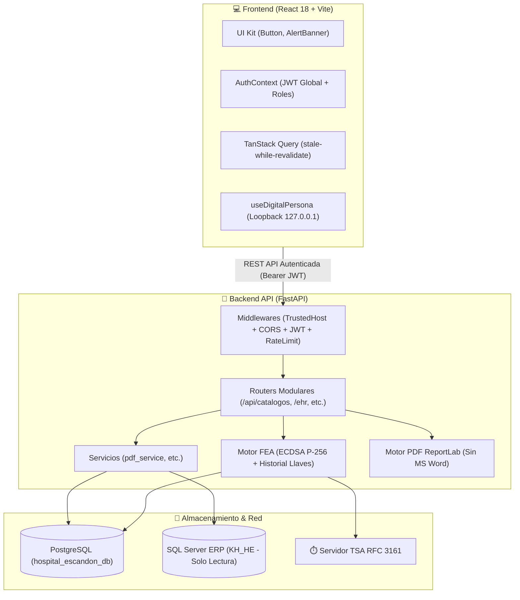

# Arquitectura

Sistema integral de gestión clínica del Hospital Escandón: EHR + FEA + biometría + PDFs oficiales.



## Distribución biométrica AF-02

El servidor central hospital sirve FastAPI/PostgreSQL/frontend e integraciones
por HTTPS/LAN. Cada PC médica tiene navegador, HES Biometric Agent limitado a
127.0.0.1:8082, SDK nativo DigitalPersona y lector 4500 USB. Captura y comparación
ocurren en esa estación; el backend valida evidencia firmada y mantiene FMD
canónico. No requiere USB/SDK ni matcher localhost en el servidor. La PC de
desarrollo sólo se usa para desarrollo y pruebas. Ver [[Biometria-DigitalPersona]].

## Stack verificado
- **Backend:** FastAPI + Uvicorn, SQLAlchemy + Pydantic v2, `python-jose` (JWT HS256), `slowapi` (rate-limit), `cryptography` (ECDSA P-256, HKDF-SHA256, Fernet), `reportlab` + `xhtml2pdf` + `openpyxl`, `pyodbc` (KH_HE), `pillow`, `qrcode`.
- **Frontend:** React 19 (package.json; doc histórica dice 18), Vite 8, Tailwind 4, TanStack Query 5, Axios, React Router 7, DigitalPersona (`@digitalpersona/devices/websdk`), `pdfjs-dist`, `jspdf`, `html2canvas`, `recharts`.
- **Datos:** PostgreSQL + SQL Server ERP solo lectura + TSA externo.

## Estructura real del repo
```text
Bitacora_HES/
├── backend/            # FastAPI: main.py (~12k líneas), security.py, crypto_fea.py, tsa_client.py
│   ├── routers/        # catalogos.py (+ routers inline en main.py)
│   ├── services/       # pdf_service.py
│   ├── pdf_engine_*.py # 02,04,06,07,08,11,12,15,19,24,25,32_01,34_01,43,eed,expediente,v2
│   ├── models.py / schemas.py / database.py / seed.py / kh_database.py
├── frontend/src/       # main.jsx, App.jsx, api.js
│   ├── context/AuthContext.jsx
│   ├── hooks/          # useQueries, useApiError, useDigitalPersona, useFingerprint...
│   ├── features/       # ehr/, admin/, biometrics/
│   ├── pages/          # PatientDashboard, CapturaEnfermeria, CamasDashboard...
│   └── components/ui/  # Button, AlertBanner
├── mobile_app/         # Expo (AGENTS.md propio)
├── scripts/            # backup_db.bat / .sh (rotación 14 días)
├── docs/               # ← ESTA BÓVEDA OBSIDIAN
├── plantillas/         # plantillas clínicas PDF (repo raíz, no confundir con docs/plantillas/)
├── preparar_produccion.py + pase_a_produccion/ (gitignored)
└── AGENTS.md + opencode.json  # contexto IA
```

> ⚠️ No confundir `plantillas/` (raíz, artefactos clínicos) con `docs/plantillas/` (templates de notas Obsidian).

## Flujo de firma (resumen)
`Médico → useDigitalPersona → Backend challenge (120s) → match FMD → unlock private_key_enc en RAM → ECDSA sign SHA-256 → TSA timestamp → guarda + PDF QR → auditoria_logs` — detalle en [[Seguridad-FEA]].

---
> 🤖 *Contexto IA: `backend/main.py` es monolito con routers inline; buscar endpoints con `grep def .*_endpoint` o `@app.api_route`. Frontend: extender `useQueries.js`.*
