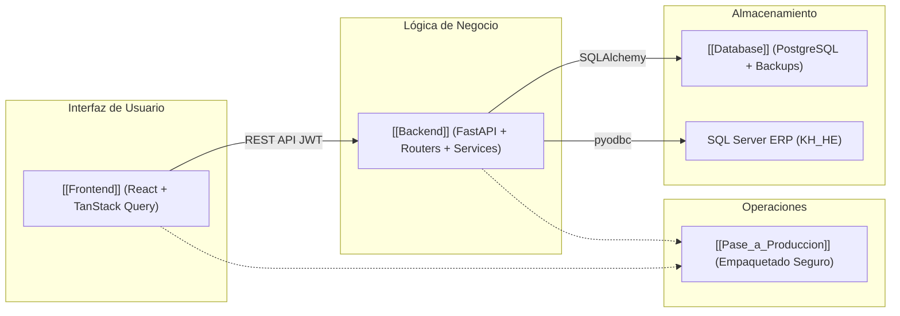

# Mapa del Proyecto

Visión general y diagrama de interconexión entre todos los módulos del sistema hospitalario HES.

## Resumen de Módulos
- **[[Frontend]]:** SPA React 18 con Vite, UI Kit atómico, TanStack Query y captura de huellas DigitalPersona.
- **[[Backend]]:** FastAPI modular con routers (`catalogos.py`), servicios (`pdf_service.py`) y motor criptográfico asimétrico FEA.
- **[[Database]]:** PostgreSQL con modelos clínicos, logs inmutables y tabla `historial_llaves_fea`.
- **[[Pase_a_Produccion]]:** Protocolo de empaquetado seguro excluyendo credenciales sensibles.
