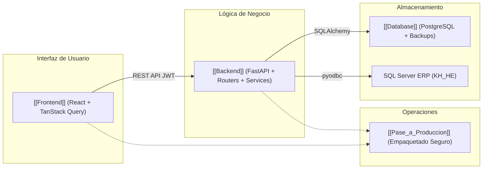

# Mapa del Proyecto

Visión general y diagrama de interconexión entre todos los módulos del sistema hospitalario HES.
Ver punto de entrada: [[00_Inicio]] · Arquitectura detallada: [[Arquitectura]].

```mermaid
graph LR
    subgraph Cliente ["Interfaz de Usuario"]
        F["[[Frontend]] (React + TanStack Query)"]
    end

    subgraph Servidor ["Lógica de Negocio"]
        B["[[Backend]] (FastAPI + Routers + Services)"]
    end

    subgraph Persistencia ["Almacenamiento"]
        D["[[Database]] (PostgreSQL + Backups)"]
        SQL["SQL Server ERP (KH_HE)"]
    end

    subgraph Despliegue ["Operaciones"]
        P["[[Pase_a_Produccion]] (Empaquetado Seguro)"]
    end

    F -->|REST API JWT| B
    B -->|SQLAlchemy| D
    B -->|pyodbc| SQL
    B -.-> P
    F -.-> P
```

## Resumen de Módulos
- **[[Frontend]]:** SPA React 18 con Vite, UI Kit atómico, TanStack Query y captura de huellas DigitalPersona.
- **[[Backend]]:** FastAPI modular con routers (`catalogos.py`), servicios (`pdf_service.py`) y motor criptográfico asimétrico FEA.
- **[[Database]]:** PostgreSQL con modelos clínicos, logs inmutables y tabla `historial_llaves_fea`.
- **[[Pase_a_Produccion]]:** Protocolo de empaquetado seguro excluyendo credenciales sensibles.

## Capas transversales
- Seguridad y firma: [[Seguridad-FEA]] · Biometría: [[Biometria-DigitalPersona]] · PDFs: [[Formatos-PDF]]
- Norma y cumplimiento: [[Normativa-NOM]] · API: [[API-Endpoints]] · Reglas IA: [[Guia-Desarrollo-IA]]
- Decisiones: [[decisiones/ADR-0001-reportlab-sin-word]] · [[decisiones/ADR-0002-fea-historial-llaves]] · [[decisiones/ADR-0003-tanstack-query]]

---
> 🤖 *Contexto IA: esta nota es el grafo navegable. Para entender el sistema completo empieza en [[00_Inicio]] y luego [[Arquitectura]].*
